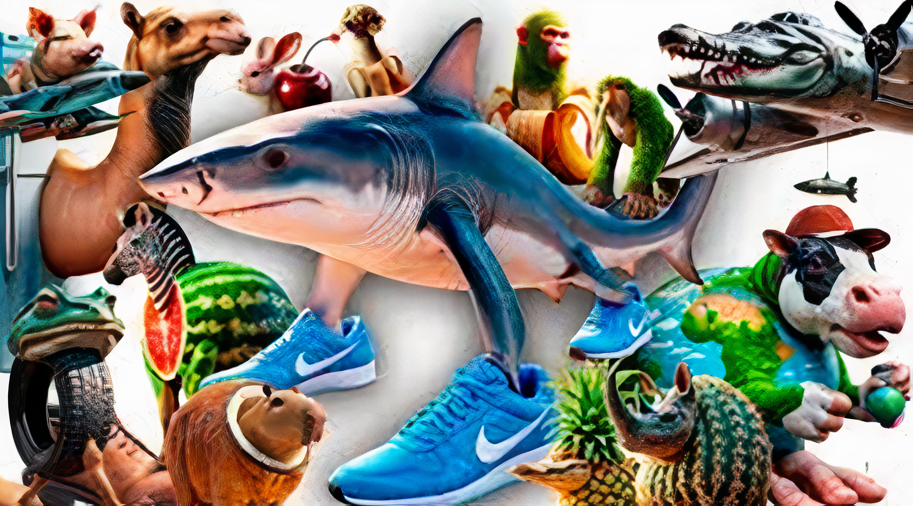

# Meme-Website-Parser

Небольшой парсер главной страницы сайта `memepedia.ru`. Ищет, конечно же, страницу про brainrot animals и выводит их список (с заголовком).

Все необходимые зависимости сохранены в src/requirements.txt.

